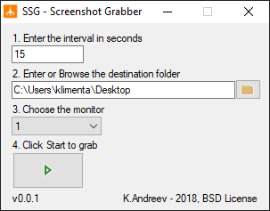
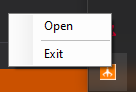
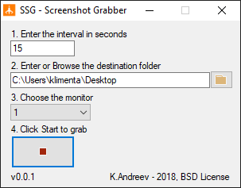

# SSG - ScreenShot Grabber

## Usage

* Specify the interval how often to take screenshots
* Specify the destination folder
* Specify the monitor if you have multiple monitors
* Click start to take screesnhots in JPEG format

Once you click **START** the program minimizes itself in the tray.
If you want to reopen it, right-click on the icon in the tray and click **Open**.

You can click **STOP** to stop recording or just close the program. 

## Screenshot files

The files are in JPEG format and the filenames are the actual timestamps when they were taken, e.g. 20201228163924.jpg means December 16th, 2020 at 4:39:24PM.

# Download

You can compile using Visual Studio and .NET 4.5 or download the binary from the releases section.
